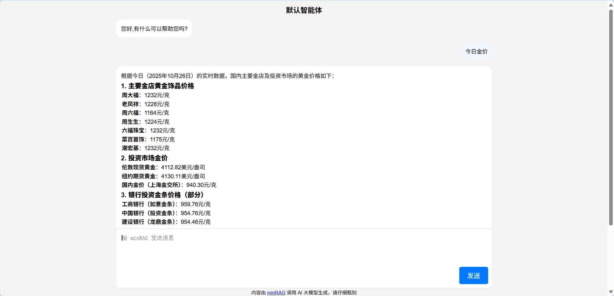
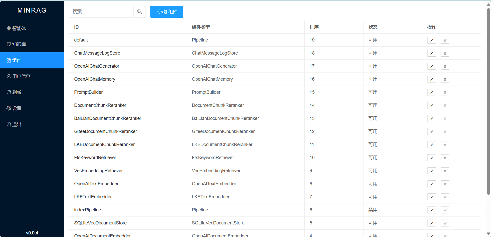

    

<a href="./README.md">English</a> | <a href="./README.zh-CN.md">简体中文</a> | <a href="./minragdatadir/public/doc/index.md">Help</a>

## RAG Has Never Been So Easy      
minRAG is a RAG system built from scratch, pursuing extreme simplicity and power, with no more than 10,000 lines of code. It supports AI platforms such as OpenAI, Gitee AI, Baidu Qianfan, Tencent Cloud LKE, Alibaba Cloud BaiLian, and ByteDance Volcano Engine. No installation is required; just double-click to start.    
It uses FTS5 for BM25 full-text search and Vec for vector retrieval. It implements components such as MarkdownConverter, DocumentSplitter, OpenAIDocumentEmbedder, SQLiteVecDocumentStore, OpenAITextEmbedder, VecEmbeddingRetriever, FtsKeywordRetriever, DocumentChunkReranker, PromptBuilder, OpenAIChatMemory, OpenAIChatGenerator, ChatMessageLogStore, Pipeline, etc., supporting pipeline setup and extension.  

## Supported AI PlatformsSince       
reranker does not have a unified standard, the `base_url` in the component parameters must be filled in with the complete path.  

### OpenAI    
**minRAG implements the standard specifications of OpenAI, and all platforms compatible with OpenAI can be used.**  

### Gitee AI (Default)  
The default AI platform is [Gitee AI](https://ai.gitee.com). Gitee AI offers 100 free calls per day.  
- On the registration or settings page, fill in `base_url` for the AI platform as `https://ai.gitee.com/v1`.  
- On the registration or settings page, fill in `api_key` with a free or paid token.    
- `OpenAITextEmbedder` defaults to using the `bge-m3` model.  
- The component parameter for `GiteeDocumentChunkReranker` is `{"base_url":"https://ai.gitee.com/api/serverless/bge-reranker-v2-m3/rerank","model":"bge-reranker-v2-m3"}`.  
- `OpenAIChatGenerator` is recommended to use the `DeepSeek-V3` model.  

### Tencent Cloud LKE Knowledge Engine
- On the registration or settings page, fill in `base_url` for the AI platform as `SecretId`, or configure it in the component parameters as `{"SecretId":"xxx"}`.    
- On the registration or settings page, fill in `api_key` as `SecretKey`, or configure it in the component parameters as `{"SecretKey":"xxx"}`.
- `LKETextEmbedder` and `LKEDocumentEmbedder` default to using the `lke-text-embedding-v1` model.  
- `LKEDocumentChunkReranker` defaults to using the `lke-reranker-base` model.  
- `OpenAIChatGenerator` [connects using the OpenAI SDK method](https://console.cloud.tencent.com/lkeap). The component parameter configuration is `{"base_url":"https://api.lkeap.cloud.tencent.com/v1","api_key":"xxx","model":"deepseek-v3"}`.  
- Remember to modify the components in the pipeline.  

### Baidu QianFan  
- On the registration or settings page, fill in `base_url` for the AI platform as `https://qianfan.baidubce.com/v2`.  
- On the registration or settings page, fill in `api_key` with a permanently valid API Key.  
- `OpenAITextEmbedder` and `OpenAIDocumentEmbedder` default to using the `bge-large-zh` model, with 1024 dimensions.  
- The component parameter configuration for `DocumentChunkReranker` is `{"base_url":"https://qianfan.baidubce.com/v2/rerankers","model":"bce-reranker-base","top_n":5,"score":0.1}`.  
- `OpenAIChatGenerator` is recommended to use the `deepseek-v3` model.  
- Remember to modify the components in the pipeline.  

### Alibaba Cloud BaiLian
- On the registration or settings page, fill in `base_url` for the AI platform as `https://dashscope.aliyuncs.com/compatible-mode/v1`.
- On the registration or settings page, fill in `api_key` with the applied API KEY.
- `OpenAITextEmbedder` and `OpenAIDocumentEmbedder` default to using the `text-embedding-v3` model, with 1024 dimensions.
- The component parameter configuration for `BaiLianDocumentChunkReranker` is `{"base_url":"https://dashscope.aliyuncs.com/api/v1/services/rerank/text-rerank/text-rerank","model":"gte-rerank","top_n":5,"score":0.1}`.
- `OpenAIChatGenerator` is recommended to use the `deepseek-v3` model.
- Remember to modify the components in the pipeline.  

### ByteDance Volcano Engine  
- On the registration or settings page, fill in `base_url` for the AI platform as `https://ark.cn-beijing.volces.com/api/v3`.  
- On the registration or settings page, fill in `api_key` with the applied API KEY.  
- `OpenAITextEmbedder` and `OpenAIDocumentEmbedder` are recommended to use the `doubao-embedding` model, compatible with 1024 dimensions.
- Volcano Engine does not currently have a Reranker model, so it is recommended to use Reranker models from other platforms or remove it.
- `OpenAIChatGenerator` is recommended to use the `deepseek-v3` model.
- Remember to modify the components in the pipeline.

## UI Preview
    

    

## Tika Integration 
By default, minRAG only supports text formats like Markdown and plain text. To parse document content, you can use the ```TikaConverter``` component to call the ```tika``` service. Example configuration for ```TikaConverter```:
```json
{
	"tikaURL": "http://localhost:9998/tika",
	"defaultHeaders": {
		"Content-Type": "application/octet-stream"
	}
}
```

Start the ```tika``` service with this command:
```shell
## Apache Tika 3.x requires JDK 11 or later
java -jar tika-server-standard-3.1.0.jar --host=0.0.0.0 --port=9998

## To disable logging
#nohup java -jar tika-server-standard-3.1.0.jar --host=0.0.0.0 --port=9998 >/dev/null 2>&1 &
```

Alternatively, download [tika-windows](https://pan.baidu.com/s/1OR0DaAroxf8dBTwDz36Ceww?pwd=1234) and use ```start.bat``` to launch Tika.

Note: Modify the parameters in your ```indexPipeline``` workflow by replacing the original ```MarkdownConverter``` with ```TikaConverter```:
```json
{
	"start": "TikaConverter",
	"process": {
		"TikaConverter": "DocumentSplitter",
		"DocumentSplitter": "OpenAIDocumentEmbedder",
		"OpenAIDocumentEmbedder": "SQLiteVecDocumentStore"
	}
}
```

## Development Environment  
minRAG uses ```https://github.com/wangfenjin/simple``` as the FTS5 full-text search extension. The compiled libsimple file is placed in the ```minragdatadir/extensions``` directory. If minRAG fails to start and reports an error connecting to the database, please check if the libsimple file is correct. If you need to recompile libsimple, please refer to https://github.com/wangfenjin/simple.  

The default port is 738, and the backend management address is http://127.0.0.1:738/admin/login.  
First, unzip ```minragdatadir/dict.zip```.  
Run ```go run --tags "fts5" .```.  
Package: ```go build --tags "fts5" -ldflags "-w -s"```.  

The development environment requires CGO compilation configuration. Set ```set CGO_ENABLED=1```, download [mingw64](https://github.com/niXman/mingw-builds-binaries/releases) and [cmake](https://cmake.org/download/), and configure the bin to the environment variables. Note to rename ```mingw64/bin/mingw32-make.exe``` to ```make.exe```.  
Modify vscode's launch.json to add ``` ,"buildFlags": "--tags=fts5" ``` for debugging fts5.  
Test needs to be done manually: ```go test -v -count=1 -timeout 30s --tags "fts5" -run ^TestVecQuery$ gitee.com/minrag/minrag```.  
Package: ```go build --tags "fts5" -ldflags "-w -s"```.  
When recompiling simple, it is recommended to use the precompiled version from ```https://github.com/wangfenjin/simple```.  
Note to modify the Windows compilation script, remove the ```libgcc_s_seh-1.dll``` and ```libstdc++-6.dll``` dependencies for mingw64 compilation, and turn off ```BUILD_TEST_EXAMPLE``` as there are conflicts.  
```bat
rmdir /q /s build
mkdir build && cd build
cmake .. -G "Unix Makefiles" -DBUILD_TEST_EXAMPLE=OFF -DCMAKE_INSTALL_PREFIX=release -DCMAKE_CXX_FLAGS="-static-libgcc -static-libstdc++" -DCMAKE_EXE_LINKER_FLAGS="-Wl,-Bstatic -lstdc++ -lpthread -Wl,-Bdynamic"
make && make install
```

## Backend Management Supports English
The minRAG backend management currently supports both Chinese and English, with the capability to extend to other languages. Language files are located in ```minragdatadir/locales```. By default, the system uses Chinese (```zh-CN```) upon initial installation. If English is preferred, you can modify the ```"locale":"zh-CN"``` to ```"locale":"en-US"``` in the ```minragdatadir/install_config.json``` file before installation. Alternatively, after successful installation, you can change the ```Language``` setting to ```English``` in the ```Settings``` and restart the system to apply the changes.

## Table Structure  
ID defaults to timestamp (23 digits) + random number (9 digits), globally unique.  
Table creation statement ```minragdatadir/minrag.sql```  

### Configuration (Table Name: config)
Reads ```minragdatadir/install_config.json``` during installation.

| columnName  | Type| Description | Remarks       | 
|-|---|-|-----|
| id  | string      | Primary Key | minrag_config |
| basePath    | string      | Base Path   | Default /     |
| jwtSecret   | string      | JWT Secret Key      | Randomly generated |
| jwttokenKey | string      | JWT Key     | Default jwttoken |
| serverPort  | string      | IP:Port     | Default :738  |
| timeout     | int | JWT Timeout in seconds | Default 7200 |
| maxRequestBodySize  | int | Maximum Request Body Size | Default 20M |
| locale      | string      | Language Pack       | Default zh-CN,en-US |
| proxy       | string      | HTTP Proxy Address  |       |
| createTime  | string      | Creation Time       | 2006-01-02 15:04:05 |
| updateTime  | string      | Update Time | 2006-01-02 15:04:05 |
| createUser  | string      | Creator     | Initialized as system |
| sortNo      | int | Sort Order  | Descending    |
| status      | int | Status      | Disabled(0), Enabled(1) |

### User (Table Name: user)
| columnName  | Type| Description | Remarks       | 
|---|---|-|-----|
| id  | string      | Primary Key | minrag_admin  |
| account     | string      | Login Name  | Default admin |
| passWord    | string      | Password    | -     |
| userName    | string      | Description | -     |
| createTime  | string      | Creation Time       | 2006-01-02 15:04:05 |
| updateTime  | string      | Update Time | 2006-01-02 15:04:05 |
| createUser  | string      | Creator     | Initialized as system |
| sortNo      | int | Sort Order  | Descending    |
| status      | int | Status      | Disabled(0), Enabled(1) |

### Site Information (Table Name: site)
| columnName    | Type| Description | Remarks       | 
|-----|---|-|-----|
| id    | string      | Primary Key | minrag_site   |
| title | string      | Site Name   | -     |
| keyword       | string      | Keywords    | -     |
| description   | string      | Site Description    | -     |
| theme | string      | Default Theme       | Default is default |
| themePC       | string      | PC Theme    | Fetched from cookie first, if not, from Header, then written to cookie, default is default |
| themeWAP      | string      | Mobile Theme| Fetched from cookie first, if not, from Header, then written to cookie, default is default |
| themeWX       | string      | WeChat Theme| Fetched from cookie first, if not, from Header, then written to cookie, default is default |
| logo  | string      | Logo| -     |
| favicon       | string      | Favicon     | -     |
| createTime    | string      | Creation Time       | 2006-01-02 15:04:05 |
| updateTime    | string      | Update Time | 2006-01-02 15:04:05 |
| createUser    | string      | Creator     | Initialized as system |
| sortNo| int | Sort Order  | Descending    |
| status| int | Status      | Disabled(0), Enabled(1) |

### Knowledge Base (Table Name: knowledgeBase)
| columnName  | Type| Description | Remarks       | 
|-|---|-|-----|
| id  | string      | Primary Key | URL path, separated by /, e.g., /web/ |
| name| string      | Knowledge Base Name | -     |
| pid | string      | Parent Knowledge Base ID | Parent Knowledge Base ID |
| knowledgeBaseType   | int | Knowledge Base Type | -     |
| createTime  | string      | Creation Time       | 2006-01-02 15:04:05 |
| updateTime  | string      | Update Time | 2006-01-02 15:04:05 |
| createUser  | string      | Creator     | Initialized as system |
| sortNo      | int | Sort Order  | Descending    |
| status      | int | Status      | Disabled(0), Enabled(1) |

### Document (Table Name: document)
| columnName  | Type| Description | Tokenized | Remarks  | 
|-|---|-|-|------|
| id  | string      | Primary Key | No| URL path, separated by /, e.g., /web/nginx-use-hsts |
| name| string      | Document Name       | No| -|
| knowledgeBaseID     | string      | Knowledge Base ID   | No| -|
| knowledgeBaseName   | string      | Knowledge Base Name | No| -|
| toc | string      | Table of Contents   | No| -|
| summary     | string      | Summary     | No| -|
| markdown    | string      | Markdown Content    | No| -|
| filePath    | string      | File Path   | No| -|
| fileSize    | int | File Size   | No| -|
| fileExt     | string      | File Extension      | No| -|
| createTime  | string      | Creation Time       | - | 2006-01-02 15:04:05      |
| updateTime  | string      | Update Time | - | 2006-01-02 15:04:05      |
| createUser  | string      | Creator     | - | Initialized as system    |
| sortNo      | int | Sort Order  | - | Descending       |
| status      | int | Status      | - | Disabled(0), Enabled(1), Processing(2), Failed(3) |

### Document Chunk (Table Name: document_chunk)
| columnName  | Type| Description | Tokenized | Remarks  | 
|-|---|-|-|------|
| id  | string      | Primary Key | No| -|
| documentID  | string      | Document ID | No| -|
| knowledgeBaseID     | string      | Knowledge Base ID   | No| -|
| knowledgeBaseName   | string      | Knowledge Base Name | No| -|
| markdown    | string      | Markdown Content    | Yes       | Using jieba tokenizer    |
| createTime  | string      | Creation Time       | - | 2006-01-02 15:04:05      |
| updateTime  | string      | Update Time | - | 2006-01-02 15:04:05      |
| createUser  | string      | Creator     | - | Initialized as system    |
| sortNo      | int | Sort Order  | - | Descending       |
| status      | int | Status      | - | Disabled(0), Enabled(1), Processing(2), Failed(3) |

### Component (Table Name: component)
| columnName  | Type| Description | Tokenized | Remarks  | 
|-|---|-|-|------|
| id  | string      | Primary Key | No| -|
| componentType       | string      | Component Type      | No| -|
| parameter   | string      | Component Parameters| No| -|
| createTime  | string      | Creation Time       | - | 2006-01-02 15:04:05      |
| updateTime  | string      | Update Time | - | 2006-01-02 15:04:05      |
| createUser  | string      | Creator     | - | Initialized as system    |
| sortNo      | int | Sort Order  | - | Descending       |
| status      | int | Status      | - | Disabled(0), Enabled(1)  |

### Agent (Table Name: agent)
| columnName  | Type| Description | Tokenized | Remarks  | 
|-|---|-|-|------|
| id  | string      | Primary Key | No| -|
| name| string      | Agent Name  | No| -|
| knowledgeBaseID     | string      | Knowledge Base ID   | No| -|
| pipelineID  | string      | Pipeline ID | No| -|
| defaultReply| string      | Default Reply       | No| -|
| agentType   | int | Agent Type  | No| -|
| agentPrompt | string      | Agent Prompt| No| -|
| avatar      | string      | Agent Avatar| No| -|
| welcome     | string      | Welcome Message     | No| -|
| tools       | string      | Functions to Call   | No| -|
| memoryLength| int | Context Memory Length| No| -|
| createTime  | string      | Creation Time       | - | 2006-01-02 15:04:05      |
| updateTime  | string      | Update Time | - | 2006-01-02 15:04:05      |
| createUser  | string      | Creator     | - | Initialized as system    |
| sortNo      | int | Sort Order  | - | Descending       |
| status      | int | Status      | - | Disabled(0), Enabled(1)  |

### Chat Room (Table Name: chat_room)
| Column Name      | Type        | Description    | Tokenized |  Remarks  | 
| ---              | ---         | ---            | -------   | ------    |
| id               | string      | Primary Key         | No   |    -  |
| name             | string      | Chat Room Name        | No   |    -  |
| agentID          | string      | Agent ID            | No   |    -  |
| pipelineID       | string      | Pipeline ID         | No   |    -  |
| knowledgeBaseID  | string      | Knowledge Base ID   | No   |    -  |
| userID           | string      | User ID             | No   |    -  |
| createTime       | string      | Creation Time       |No    | 2006-01-02 15:04:05|

### Message Log (Table Name: message_log)
| Column Name      | Type        | Description    | Tokenized |  Remarks  | 
| ---              | ---         | ---            | -------   | ------    |
| id               | string      | Primary Key         | No   |    -  |
| agentID          | string      | Agent ID            | No   |    -  |
| roomID           | string      | Chat Room ID        | No   |    -  |
| pipelineID       | string      | Pipeline ID         | No   |    -  |
| knowledgeBaseID  | string      | Knowledge Base ID   | No   |    -  |
| userMessage      | string      | User's Message      | No   |    -  |
| aiMessage        | string      | AI's Response       | No   |    -  |
| userID           | string      | User ID             | No   |    -  |
| createTime       | string      | Creation Time       |No    | 2006-01-02 15:04:05|