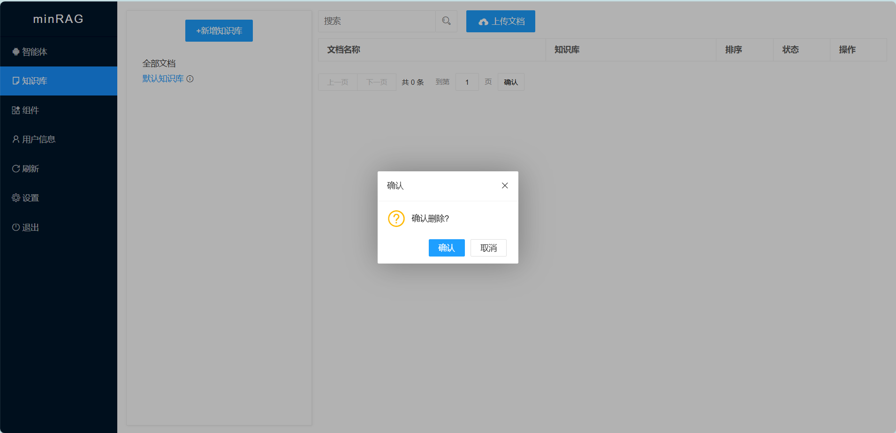
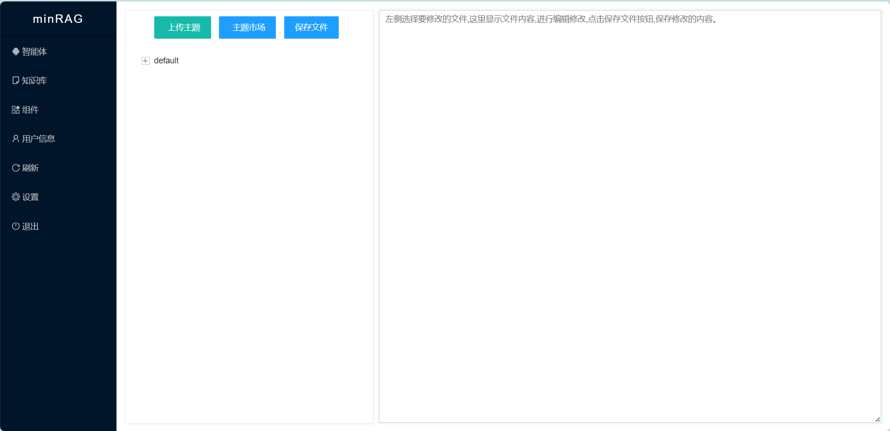

# minRAG帮助文档

    

## RAG 从未如此简单 
minRAG是从零开始的RAG系统,追求极致的简单和强大,不超过1万行代码,无需安装,双击启动.支持OpenAI、Gitee AI、百度千帆、腾讯云LKE、阿里云百炼、字节火山引擎等AI平台.        
  
使用FTS5实现BM25全文检索,使用Vec实现向量检索,实现了
MarkdownConverter、DocumentSplitter、OpenAIDocumentEmbedder、SQLiteVecDocumentStore、OpenAITextEmbedder、VecEmbeddingRetriever、FtsKeywordRetriever、DocumentChunkReranker、PromptBuilder、OpenAIChatMemory、OpenAIChatGenerator、ChatMessageLogStore、Pipeline、WebSearch、HtmlCleaner、WebScraper等组件,支持流水线设置和扩展. 

## RAG 从未如此简单 
minRAG是从零开始的RAG系统,追求极致的简单和强大,不超过1万行代码,无需安装,双击启动.支持OpenAI、Gitee AI、百度千帆、腾讯云LKE、阿里云百炼、字节火山引擎等AI平台.          
  
RAG入门教程: [<<十天手搓 minRAG, 操纵 DeepSeek 的幕后黑手>>](https://my.oschina.net/baobao/blog/17679781)  

## 支持的AI平台
因为 reranker 没有统一标准,组件参数中base_url要填写完整的路径   

### OpenAI
**minRAG实现了OpenAI的标准规范,所有兼容OpenAI的平台都可以使用.**     

### Gitee AI(默认)
AI平台默认是 [Gitee AI](https://ai.gitee.com),Gitee AI每天100次免费调用
- 注册或设置页面的AI平台```base_url``` 填写 https://ai.gitee.com/v1
- 注册或设置页面的AI平台```api_key```  填写 免费或者付费的token
- ```OpenAITextEmbedder``` 默认使用 ```bge-m3``` 模型  
- ```DocumentChunkReranker```默认使用 ```bge-reranker-v2-m3``` 模型   
- ```OpenAIChatGenerator``` 建议使用 ```DeepSeek-V3.2-Exp``` 模型  

### 腾讯云LKE知识引擎
- 注册或设置页面的AI平台```base_url``` 填写 ```SecretId```  ,或在组件参数配置```{"SecretId":"xxx"}```
- 注册或设置页面的AI平台```api_key```  填写 ```SecretKey``` ,或在组件参数配置```{"SecretKey":"xxx"}```
- ```LKETextEmbedder和LKEDocumentEmbedder``` 默认使用 ```lke-text-embedding-v2``` 模型  
- ```LKEDocumentChunkReranker``` 默认使用 ```lke-reranker-base``` 模型
- ```OpenAIChatGenerator``` [使用OpenAI SDK方式接入](https://console.cloud.tencent.com/lkeap),组件参数配置 ```{"base_url":"https://api.lkeap.cloud.tencent.com/v1","api_key":"xxx","model":"deepseek-v3.2-exp"}```  
- 记得修改流水线中的组件

### 百度千帆
- 注册或设置页面的AI平台```base_url``` 填写 https://qianfan.baidubce.com/v2
- 注册或设置页面的AI平台```api_key```  填写 永久有效API Key
- ```OpenAITextEmbedder```和```OpenAIDocumentEmbedder``` 默认使用 ```bge-large-zh``` 模型,1024维度  
- ```DocumentChunkReranker``` 组件参数配置 ```{"base_url":"https://qianfan.baidubce.com/v2/rerankers","model":"Qwen3-Reranker-8B","top_n":5,"score":0.1}```  
- ```OpenAIChatGenerator``` 建议使用 ```deepseek-v3.2``` 模型 
- 记得修改流水线中的组件

### 阿里云百炼  
- 注册或设置页面的AI平台```base_url``` 填写 https://dashscope.aliyuncs.com/compatible-mode/v1
- 注册或设置页面的AI平台```api_key```  填写 申请的API KEY
- ```OpenAITextEmbedder```和```OpenAIDocumentEmbedder``` 默认使用 ```text-embedding-v3``` 模型,1024维度 
- ```BaiLianDocumentChunkReranker``` 组件参数配置 ```{"base_url":"https://dashscope.aliyuncs.com/api/v1/services/rerank/text-rerank/text-rerank","model":"qwen3-rerank","top_n":5,"score":0.1}```  
- ```OpenAIChatGenerator``` 建议使用 ```deepseek-v3.2-exp``` 模型 
- 记得修改流水线中的组件

### 字节火山引擎
- 注册或设置页面的AI平台```base_url``` 填写 https://ark.cn-beijing.volces.com/api/v3
- 注册或设置页面的AI平台```api_key```  填写 申请的API KEY
- ```OpenAITextEmbedder```和```OpenAIDocumentEmbedder``` 建议使用```doubao-embedding```模型,兼容1024维度 
- ```DocumentChunkReranker``` 火山引擎暂时没有Reranker模型,建议使用其他平台的Reranker模型或者去掉  
- ```OpenAIChatGenerator``` 建议使用 ```deepseek-v3-1-terminus```模型  
- 记得修改流水线中的组件

## markitdown集成(默认)
使用 [https://gitee.com/minrag/markitdown](https://gitee.com/minrag/markitdown) 解析文档,使用```python build.py```编译的```dist/markitdown```放到 ```minragdatadir```目录下,```MarkdownConverter```组件配置示例:
```json
{
    // 图片解析的模型
    "model":"Qwen3-VL-30B-A3B-Instruct", 
    // 理解文档中图片的提示词
    "prompt":"提取图片内容,不要有引导语,介绍语,换行等", 
    // markdown的命令路径
    "markitdown":"minragdatadir/markitdown/markitdown",
    // 生成的markdown文件目录
    "markdownDir":"minragdatadir/upload/markitdown/markdown",
    // 图片存放的目录
    "imageFileDir":"minragdatadir/upload/markitdown/image",
    // URL的前缀目录
    "imageURLDir":"/upload/markitdown/image"
}
```

## tika集成
默认minRAG只支持markdown和text等文本格式,可以使用```TikaConverter```组件调用```tika```服务解析文档内容,```TikaConverter```组件配置示例:
```json
{
    "tikaURL": "http://localhost:9998/tika",
    "defaultHeaders": {
        "Content-Type": "application/octet-stream"
    }
}
```
启动 ```tika``` 的命令如下:
```shell
## tika 3.x 依赖 jdk11+
java -jar tika-server-standard-3.1.0.jar --host=0.0.0.0 --port=9998

## 不输出日志
#nohup java -jar tika-server-standard-3.1.0.jar --host=0.0.0.0 --port=9998 >/dev/null 2>&1 &
```

或者下载[tika-windows](https://pan.baidu.com/s/1OR0DaAroxf8dBTwz36Ceww?pwd=1234)   ```start.bat```启动tika.  
注意修改```indexPipeline```流水线的参数,把原来的```MarkdownConverter```替换为```TikaConverter```:
```json
{
    "start": "TikaConverter",
    "process": {
        "TikaConverter": "DocumentSplitter",
        "DocumentSplitter": "OpenAIDocumentEmbedder",
        "OpenAIDocumentEmbedder": "SQLiteVecDocumentStore"
    }
}
```

## 安装
运行minRAG,会输出访问的路径,根据提示使用浏览器访问 ```http://127.0.0.1:738/admin/login``` 首次运行会进入安装界面.  
  
首次运行minRAG,一定要先进行安装设置管理员的账号密码.安装界面如下图:
  
支持OpenAI、Gitee AI、百度千帆、腾讯云LKE、阿里云百炼、字节火山引擎等AI平台,在安装时可以配置对应的```base_url```和对应的```api_key```,腾讯云知识引擎TKE比较特殊,需要填写```SecretId```和```SecretKey```. 
默认是[Gitee AI]平台,每天免费100次调用,可以使用免费的```api_key```进行测试. 
安装成功之后,页面会有提示信息:```恭喜您,成功安装minrag,现在请登录```
   

## 登录
浏览器访问 ```http://127.0.0.1:738/admin/login```,正常显示登录页面,输入安装时设置的账号密码.
  

## 忘记密码
- 重命名 minragdatadir/template/install.html.bak 为 install.html
- 重启minrag,重新安装初始化管理员账号密码,数据不会丢失  
  

## 智能体
登录之后,默认查看```智能体```功能,默认初始化了```default```默认智能体,列表显示```ID,名称,知识库	流水线,排序,状态,操作```
  

点击页面```+添加智能体```按钮,创建新的智能体实例:
  

字段参数说明:   
- ID: 系统默认生成的32位唯一编码,用户可以修改,提交保存后不可修改.
- 名称: 智能体的名称
- 智能体设定: 配置智能体的Prompt提示词,例如:"我是一个AI私人助手"  
- 默认回复: 设置智能体在无匹配答案时的默认回复内容,例如:"非常抱歉,可用聊其他话题吗?"    
- 欢迎语: 定义用户首次使用时的欢迎消,例如："您好,有什么可以帮助您吗?"  
- 知识库: 关联知识库,默认是```默认知识库```  
- 流水线: 关联流水线,默认是```default```流水线  
- 工具函数: ```Function Calling```调用的函数数组,例如:```["get_weather"]```  
- 排序: 排序编号,系统按照倒叙排序  
- 状态: 智能体的运行状态,有```可用```和```禁用```两个状态  

修改智能体,字段参数和添加页面一致,ID不允许修改:  
   

查看智能体,跳转到智能体的前端界面:  
  

## 知识库
查看管理知识库功能,左侧是知识库,右侧是文档    
    
```+新增知识库```跳转到新增知识库界面.  
选中知识库,字体颜色为蓝色,右侧显示改知识库下的内容,如下图示例,选中```默认知识库```   
  
知识库后面有功能提示的图标,鼠标悬浮显示功能菜单.  
  
有以下四个功能:
- 上传文档:为该知识库新增文档
- 新增子知识库:在该知识库下新增子知识库
- 编辑知识库: 编辑该知识库
- 删除知识库: 删除该知识库  
新增子知识库的功能界面如下:    
        
编辑知识库的功能界面如下:      
      
删除知识库的功能界面如下:      
      

## 文档管理
选中左侧的知识库,点击```上传文档```按钮,文档就上传到选中的知识库.上传之后文档列表如下:    
  
内容列表有基于```fts5```实现的全文检索功能,输入关键字,点击搜索图标,完成搜索.  
点击```ID```会跳转到修改界面,操作有```编辑```和```删除```.可以编辑文档所属的知识库和状态等信息,编辑功能如下:    
  

## 组件
minRAG的数据处理步骤都是组件,包括流水线也是组件,组件类型有:
- MarkdownConverter: 使用markitdown解析文档
- DocumentSplitter: 分割文档
- LKEDocumentEmbedder: 腾讯云LKE的文档Embedding模型
- OpenAIDocumentEmbedder: OpenAI的文档Embedding模型
- SQLiteVecDocumentStore: SQLiteVec的向量化保存
- Pipeline: 流水线
- WebSearch: 联网搜索组件,爬虫bing搜索的页面
- HtmlCleaner: 网页标签清理
- WebScraper: 网页爬虫
- LKETextEmbedder: 腾讯云LKE的文本Embedding模型
- OpenAITextEmbedder: OpenAI的文本Embedding模型
- VecEmbeddingRetriever: SQLiteVec向量查询
- FtsKeywordRetriever: FTS5的BM25全文检索
- LKEDocumentChunkReranker: 腾讯云LKE的Reranker模型重排序
- BaiLianDocumentChunkReranker: 阿里云百炼的Reranker模型重排序
- DocumentChunkReranker: 默认的Reranker模型重排序
- PromptBuilder: 构建Prompt提示词
- OpenAIChatMemory: 记忆聊天消息上下文
- OpenAIChatGenerator: 大模型LLM
- ChatMessageLogStore: 保存聊天记录

  

点击 ```+添加组件``` 按钮,进入添加页面,可以选择已经支持的组件类型,设置ID和组件参数  
  
其中```Pipeline```比较重要,参数格式是```{"start":"启动的组件ID","process":{"组件ID":"下一个组件ID"}}```,例如:
```json
{
	"start": "OpenAITextEmbedder",
	"process": {
		"OpenAITextEmbedder": "VecEmbeddingRetriever",
		"VecEmbeddingRetriever": "FtsKeywordRetriever",
		"FtsKeywordRetriever": "DocumentChunkReranker",
		"DocumentChunkReranker": "PromptBuilder",
		"PromptBuilder": "OpenAIChatMemory",
		"OpenAIChatMemory": "OpenAIChatGenerator",
		"OpenAIChatGenerator": "ChatMessageLogStore"
	}
}
```
  

## 用户信息
修改管理员的账号信息,功能界面如下:  


## 刷新站点
模板更改时需要刷新站点才能生效,同时刷新站点会生成静态文件,用于```Nginx```静态化访问.
```刷新站点``` 功能会生成静态html文件到 ```statichtml``` 目录,同时生成```gzip_static```文件,需要把正在使用的主题的 ```css,js,image```和```minragdatadir/public```目录复制到 ```statichtml```目录下,也可以用Nginx反向代理指定目录.    
nginx 配置示例如下:
```conf
### 当前在用主题(default)的css文件
location ~ ^/css/ {
    #gzip_static on;
    root /data/minrag/minragdatadir/template/theme/default;  
}
### 当前在用主题(default)的js文件
location ~ ^/js/ {
    #gzip_static on;
    root /data/minrag/minragdatadir/template/theme/default;  
}
### 当前在用主题(default)的image文件
location ~ ^/image/ {
    root /data/minrag/minragdatadir/template/theme/default;  
}
### search-data.json FlexSearch搜索的JSON数据
location ~ ^/public/search-data.json {
    #gzip_static on;
    root /data/minrag/minragdatadir;  
}
### public 公共文件
location ~ ^/public/ {
    root /data/minrag/minragdatadir;  
}
    
### admin 后台管理,请求动态服务
location ~ ^/admin/ {
    proxy_redirect     off;
    proxy_set_header   Host      $host;
    proxy_set_header   X-Real-IP $remote_addr;
    proxy_set_header   X-Forwarded-For   $proxy_add_x_forwarded_for;
    proxy_set_header   X-Forwarded-Proto $scheme;
    proxy_pass  http://127.0.0.1:738;  
}
###  静态html目录
location / {
    proxy_redirect     off;
    proxy_set_header   Host      $host;
    proxy_set_header   X-Real-IP $remote_addr;
    proxy_set_header   X-Forwarded-For   $proxy_add_x_forwarded_for;
    proxy_set_header   X-Forwarded-Proto $scheme; 
    ## 存在q查询参数,使用动态服务.也支持FlexSearch解析public/search-data.json
    if ($arg_q) { 
       proxy_pass  http://127.0.0.1:738;  
       break;
    }

    ### 开启gzip静态压缩
    #gzip_static on;

    ### Nginx 1.26+ 不需要再进行302重定向到目录下的index.html,gzip_static也会生效.这段配置留作记录.
    ##if ( -d $request_filename ) {
        ## 不是 / 结尾
    ##    rewrite [^\/]$ $uri/index.html redirect;
        ##以 / 结尾的
    ##    rewrite ^(.*) ${uri}index.html redirect;      
    ##}
    
    ### 当前在用主题(default)的静态文件目录
    root   /data/minrag/minragdatadir/statichtml/default;
    
    ## 避免目录 301 重定向,例如 /about 会301到 /about/           
    try_files $uri $uri/index.html;

    index  index.html index.htm;
}

```  
    

## 设置
### 修改设置
用于系统设置,需要重启minRAG才能生效.可以修改```AI平台base_url```和```AI平台api_key```  
  

### 更新SQL
执行更新的SQL语句  
  

### 站点信息
设置站点的基础内容信息,其中主题是读取```minragdatadir/template/theme```目录下的主题文件夹,更换主题之后,需要点击```刷新站点```功能,刷新前台界面. ```logo```是前台界面显示的logo,后台的logo固定为```minRAG```的logo,暂时不支持更改. 
  

## 主题模板
主题模板的增删改查功能,管理主题中的自定义模板文件,修改内容和知识库时,可以应用自定义的模板文件.  
  
支持上传主题zip压缩包,用于新增主题,也可以从```主题市场```中下载主题,进行安装     

## 退出
退出管理后台  